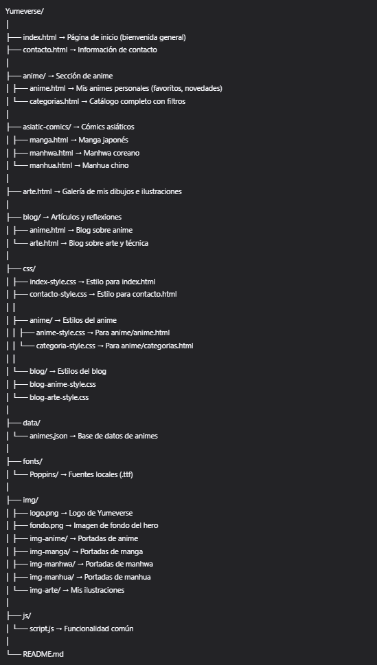

# 🌸 Yumeverse – Tu Universo de Sueños Creativos

**Yumeverse** (de *"Yume"* = sueño en japonés) es un portafolio personal que celebra mi pasión por el anime, los cómics asiáticos, el arte digital y la escritura. Es un espacio donde lo emocional, lo visual y lo narrativo se encuentran para inspirar y conectar.

---

## 📁 Estructura de Archivos

  

> ✅ **Estructura limpia, escalable y profesional**  
> 🔹 Cada sección tiene su espacio dedicado

---

## 🖥️ Barra de Navegación (en todas las páginas)

La barra superior incluye:

- **Inicio** → `index.html`
- **Anime** → `anime/anime.html`
- **Catálogo** → `anime/categorias.html`

▼ Al pasar el cursor, se despliegan menús:

### 🎌 **Cómics Asiáticos**
- **Manga (Japón)** → `asiatic-comics/manga.html`
- **Manhwa (Corea)** → `asiatic-comics/manhwa.html`
- **Manhua (China)** → `asiatic-comics/manhua.html`

### 📝 **Blog**
- **Anime** → `blog/anime.html`
- **Arte** → `blog/arte.html`

- **Arte** → `arte.html`
- **Contacto** → `contacto.html`

> 🔹 Menú **responsive** y funcional en móvil y escritorio.

---

## 📄 Descripción de las Secciones

### 🏠 `index.html`
- Diseño impactante con fondo inspirado en sueños + logo de Yumeverse.
- Mensaje de bienvenida apasionado sobre el arte y la narrativa.
- Tarjetas destacadas: “Explorar animes”, “Ver cómics”, “Galería de arte”.
- Botones grandes para acceder a cada sección.

---

### 🎌 Carpeta `anime/`

#### `anime/anime.html` → **Mis animes personales**
- ❤️ **Favoritos**: 5–10 animes con sinopsis emotivas
- 🆕 **Novedades**: últimos añadidos
- ⭐ **Recomendaciones especiales**
- Diseño elegante y colorido, como un verdadero portafolio.

#### `anime/categorias.html` → **Explorador completo**
- 🔍 Búsqueda por nombre
- 🎭 Filtros: género, tipo, estado, orden
- 📋 Lista dinámica de todos los animes
- 💬 Modal emergente con sinopsis breve

---

### 📚 Carpeta `asiatic-comics/`

#### `manga.html` | `manhwa.html` | `manhua.html`
- Listas organizadas por país de origen
- Portadas, títulos, autores, géneros y sinopsis
- Ideal para descubrir nuevas historias

---

### 🎨 `arte.html`
- Galería de mis dibujos, fanart e ilustraciones originales
- Cada obra con título, descripción y fecha
- Espacio para mostrar mi talento artístico

---

### 📝 Carpeta `blog/`

#### `blog/anime.html`
- Reseñas, análisis y reflexiones sobre anime
- Noticias, recomendaciones y listas temáticas

#### `blog/arte.html`
- Tutoriales, procesos creativos y consejos técnicos
- Inspiración y evolución artística

---

### 📩 `contacto.html`
- Información de contacto (email, redes sociales)
- Opcional: formulario de contacto simple

---

## 🧩 Características Clave

- ✅ **Portafolio integral**: anime, cómics, arte y blog en un solo lugar
- ✅ **Diseño coherente**: mismo estilo visual en todas las secciones
- ✅ **Totalmente responsive**: se ve perfecto en móvil y escritorio
- ✅ **Fácil de mantener**: archivos CSS organizados por sección
- ✅ **Escalable**: puedes añadir más contenido sin desordenar

---

## 🚀 Próximos Pasos (Opcional)

- Añadir más imágenes de portada en cada carpeta de `img/`
- Implementar sistema de “favoritos” guardados localmente
- Conectar con APIs (MyAnimeList, AniList, etc.)
- Agregar modo oscuro/claro
- Optimizar rendimiento con lazy loading

---

> 💫 **Yumeverse no es solo un sitio: es un reflejo de mis sueños, mis historias y mi forma de ver el mundo a través del arte.**
