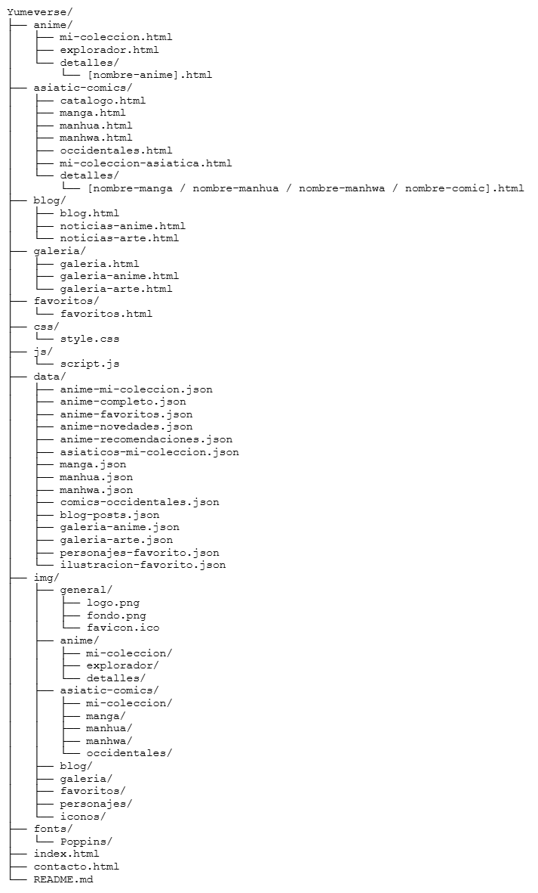

# 🌸 Yumeverse – Tu Universo de Sueños Creativos

**Yumeverse** (de *"Yume"* = sueño en japonés) es un portafolio personal que celebra mi pasión por el anime, los cómics asiáticos, el arte digital y la escritura. Es un espacio donde lo emocional, lo visual y lo narrativo se encuentran para inspirar y conectar.

---
## Indice
1. [Estructura de archivos](#-estructura-de-archivos)
2. [Barra de navegación](#-barra-de-navegación-en-todas-las-páginas)
3. [Descripción de secciones](#-descripción-de-las-secciones)
4. [Descripción links en las páginas](#describir-links-en-las-paginas)
5. [Características clave](#-características-clave)
6. [Explicar el proyecto en git](#explicar-el-proyecto-en-git)

---
## Estructura de Archivos

  

> ✅ **Estructura limpia, escalable y profesional**  
> 🔹 Cada sección tiene su espacio dedicado

---

## Barra de Navegación (en todas las páginas)

La barra superior incluye:

- **Inicio** → `index.html`
- **Anime** → `anime/explorador.html`
- **Comics Asiáticos** → `asiatic-comics/catalogo.html`
- **Galería** → `galeria/galeria.html`
- **Blog** → `blog/blog.html`
- **Contacto** → `contacto.html`

▼ Al pasar el cursor, se despliegan menús:

### **Anime**
- **Mi colección** → `anime/mi-coleccion.html`

### **Cómics Asiáticos**
- **Mi colección** → `asiatic-comics/mi-coleccion-asiatica.html`
- **Manga (Japón)** → `asiatic-comics/manga.html`
- **Manhwa (Corea)** → `asiatic-comics/manhwa.html`
- **Manhua (China)** → `asiatic-comics/manhua.html`
- **Occidentales (Ingles)** → `asiatic-comics/occidentales.html`

### **Blog**
- **Noticias Anime** → `blog/noticias-anime.html`
- **Noticias Arte** → `blog/noticias-arte.html`

### **Galería**
- **Galería Anime** → `galeria-anime.html`
- **Galería Arte** → `galeria-arte.html`

> 🔹 Menú **responsive** y funcional en móvil y escritorio.

---

## Descripción de las Secciones

---

## Describir links en las paginas

---

## Características Clave

- ✅ **Portafolio integral**: anime, cómics, arte y blog en un solo lugar
- ✅ **Diseño coherente**: mismo estilo visual en todas las secciones
- ✅ **Totalmente responsive**: se ve perfecto en móvil y escritorio
- ✅ **Fácil de mantener**: archivos CSS organizados por sección
- ✅ **Escalable**: puedes añadir más contenido sin desordenar

---

## Explicar el proyecto en git

---

> 💫 **Yumeverse** no es solo un sitio: es un reflejo de mis sueños, mis historias y mi forma de ver el mundo a través del arte.
