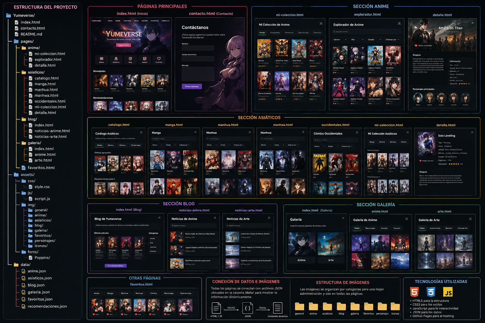
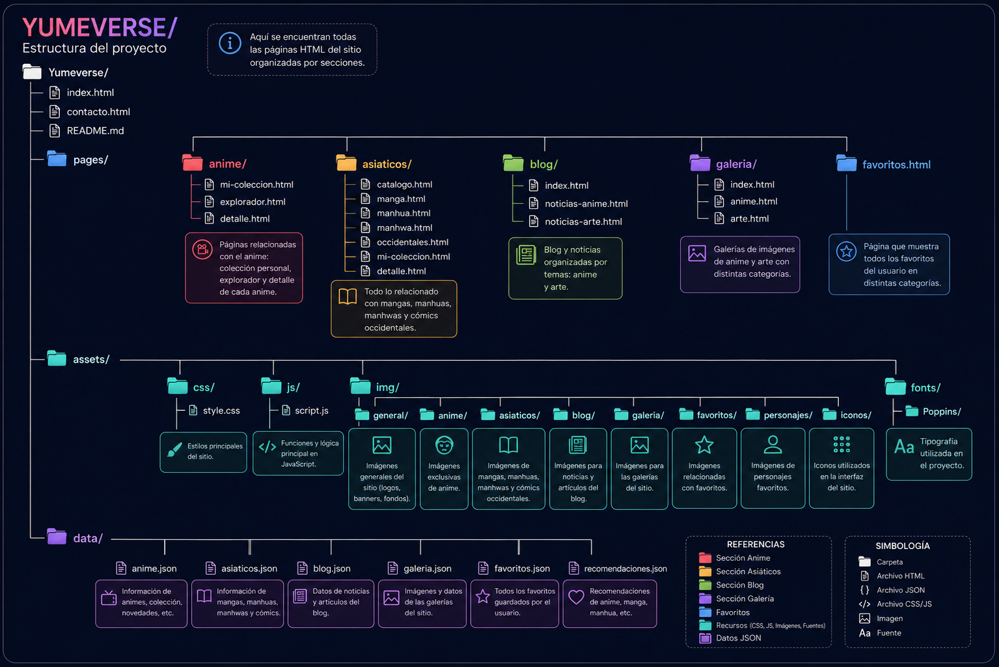
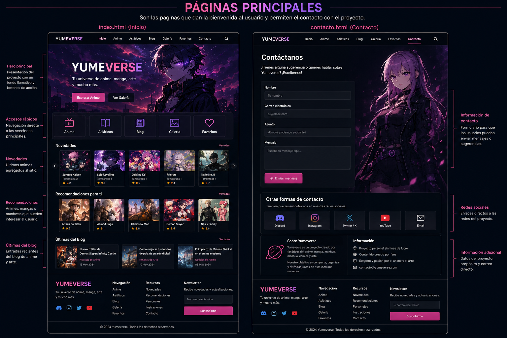
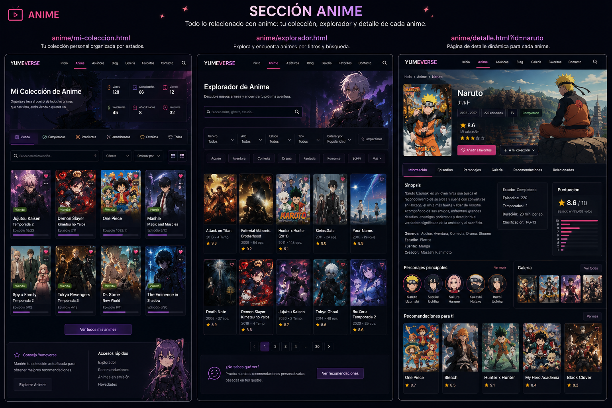
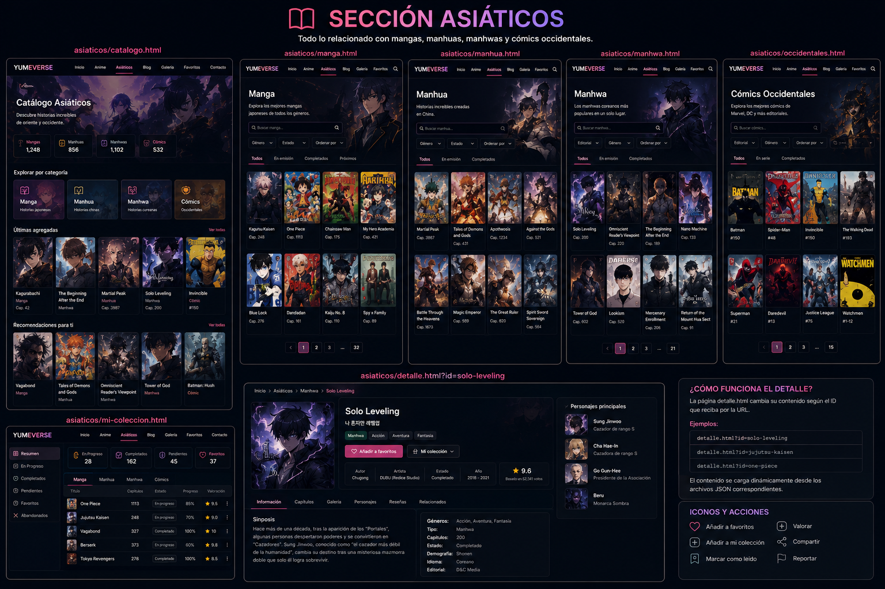
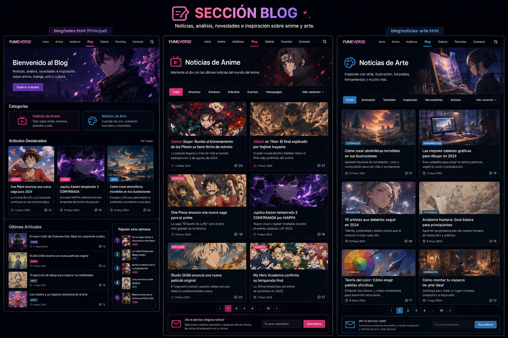
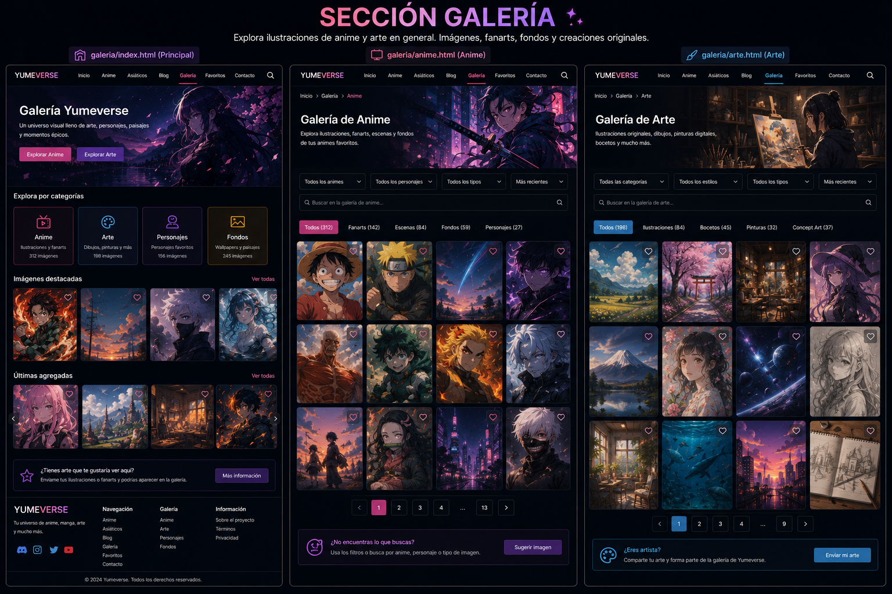
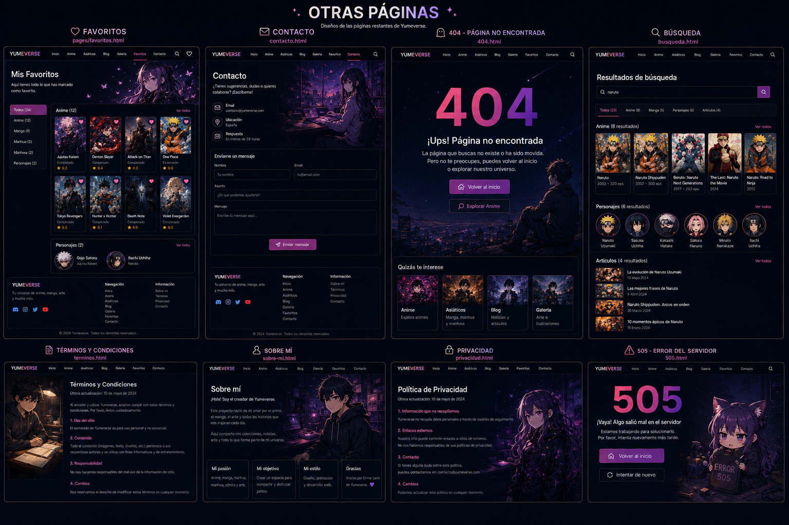
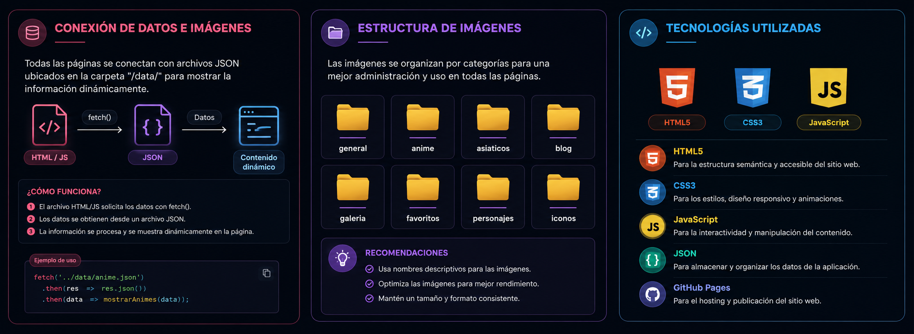

# 🌸 Yumeverse

<p align="center">
  
</p>

**Yumeverse** es una plataforma web personal enfocada en anime, manga, manhua, manhwa, cómics occidentales, ilustración digital, noticias, galerías y favoritos.

---

## 📖 Índice

- [🌸 Sobre Yumeverse](#-sobre-yumeverse)
- [🎯 Objetivos](#-objetivos)
- [🏗️ Arquitectura del Proyecto](#️-arquitectura-del-proyecto)
- [🏠 Páginas Principales](#-páginas-principales)
- [🎌 Sección Anime](#-sección-anime)
- [📚 Sección Asiáticos](#-sección-asiáticos)
- [📝 Sección Blog](#-sección-blog)
- [🖼️ Sección Galería](#️-sección-galería)
- [⭐ Otras Páginas](#-otras-páginas)
- [🔄 Flujo de Datos](#-flujo-de-datos)
- [🗂️ Gestión de Imágenes](#️-gestión-de-imágenes)
- [⚙️ Tecnologías](#️-tecnologías)
- [📂 Estructura de Datos JSON](#-estructura-de-datos-json)
- [🎨 Sistema de Diseño](#-sistema-de-diseño)
- [🚀 Roadmap](#-roadmap)
- [📜 Licencia](#-licencia)

---

## 🌸 Sobre Yumeverse

Yumeverse es una plataforma web personal enfocada en anime, manga, manhua, manhwa, cómics occidentales, ilustración digital y contenido creativo.

Su objetivo es ofrecer una experiencia visual moderna donde sea posible:

- Organizar colecciones personales.
- Explorar contenido.
- Descubrir nuevas obras.
- Leer artículos y noticias.
- Gestionar favoritos.
- Visualizar galerías.
- Centralizar toda la información en una única plataforma.

---

## 🎯 Objetivos

- Crear una biblioteca personal digital.
- Mostrar contenido de forma visual e intuitiva.
- Mantener una arquitectura escalable.
- Utilizar datos dinámicos mediante JSON.
- Garantizar compatibilidad con GitHub Pages.
- Ofrecer una experiencia responsive.

---

## 🏗️ Arquitectura del Proyecto

La siguiente imagen muestra toda la estructura del proyecto:



---

## 🏠 Páginas Principales



### `index.html`

Página principal del proyecto.

Llevará:

- Header con logo y navegación.
- Hero principal con imagen/banner.
- Presentación de Yumeverse.
- Botones rápidos hacia Anime, Asiáticos, Blog, Galería y Favoritos.
- Sección de novedades.
- Recomendaciones destacadas.
- Últimos artículos del blog.
- Galería destacada.
- Newsletter.
- Footer global.

---

### `contacto.html`

Página de contacto.

Llevará:

- Formulario de contacto.
- Campo de nombre.
- Campo de correo.
- Campo de asunto.
- Campo de mensaje.
- Redes sociales.
- Información del proyecto.
- Créditos.
- Newsletter.
- Footer.

---

## 🎌 Sección Anime



### `pages/anime/mi-coleccion.html`

Página para tu colección personal de anime.

Llevará:

- Resumen de estadísticas.
- Animes vistos.
- Animes completados.
- Animes viendo actualmente.
- Animes pendientes.
- Animes abandonados.
- Animes favoritos.
- Buscador interno.
- Filtros por estado.
- Filtros por género.
- Orden por nombre, valoración o fecha.
- Tarjetas de anime.
- Progreso de episodios.
- Botón para ver detalle.
- Botón para añadir o quitar favoritos.

---

### `pages/anime/explorador.html`

Página para descubrir animes.

Llevará:

- Buscador general.
- Filtro por género.
- Filtro por año.
- Filtro por estado.
- Filtro por tipo.
- Filtro por valoración.
- Orden por popularidad, nombre o fecha.
- Tarjetas de anime.
- Paginación.
- Botón “Ver detalle”.
- Botón de favoritos.
- Sección de recomendaciones.

---

### `pages/anime/detalle.html`

Página dinámica para mostrar el detalle de cada anime.

Funcionará así:

```text
detalle.html?id=naruto
detalle.html?id=one-piece
detalle.html?id=attack-on-titan
```

Llevará:

- Banner del anime.
- Portada.
- Título.
- Título original.
- Año.
- Episodios.
- Temporadas.
- Estado.
- Géneros.
- Estudio.
- Sinopsis.
- Valoración personal.
- Personajes principales.
- Galería del anime.
- Recomendaciones similares.
- Botón para añadir a favoritos.
- Botón para añadir a mi colección.

> 💡 No hace falta crear una página distinta para cada anime.  
> Un solo `detalle.html` carga la información según el `id` de la URL.

---

## 📚 Sección Asiáticos



### `pages/asiaticos/catalogo.html`

Página principal de mangas, manhuas, manhwas y cómics.

Llevará:

- Resumen general de categorías.
- Accesos a Manga, Manhua, Manhwa y Cómics occidentales.
- Últimas obras agregadas.
- Obras recomendadas.
- Buscador general.
- Filtros por tipo de obra.
- Tarjetas destacadas.

---

### `pages/asiaticos/manga.html`

Página dedicada al manga japonés.

Llevará:

- Lista de mangas.
- Buscador.
- Filtros por género.
- Filtros por estado.
- Orden por nombre, capítulos o valoración.
- Portadas.
- Autor.
- Capítulos.
- Estado de lectura.
- Valoración.
- Botón para ver detalle.
- Botón de favoritos.

---

### `pages/asiaticos/manhua.html`

Página dedicada al manhua chino.

Llevará:

- Lista de manhuas.
- Buscador.
- Filtros por género.
- Filtros por estado.
- Portadas.
- Autor.
- Capítulos.
- Estado.
- Valoración.
- Botón para ver detalle.
- Botón de favoritos.

---

### `pages/asiaticos/manhwa.html`

Página dedicada al manhwa coreano.

Llevará:

- Lista de manhwas.
- Buscador.
- Filtros por género.
- Filtros por estado.
- Portadas.
- Autor.
- Capítulos.
- Estado.
- Valoración.
- Botón para ver detalle.
- Botón de favoritos.

---

### `pages/asiaticos/occidentales.html`

Página dedicada a cómics occidentales.

Llevará:

- Lista de cómics.
- Buscador.
- Filtros por editorial.
- Filtros por género.
- Filtros por estado.
- Portada.
- Autor.
- Editorial.
- Número de cómic o volumen.
- Valoración.
- Botón para ver detalle.
- Botón de favoritos.

---

### `pages/asiaticos/mi-coleccion.html`

Página para tu colección personal de lecturas.

Llevará:

- Lecturas en progreso.
- Lecturas completadas.
- Lecturas pendientes.
- Lecturas favoritas.
- Lecturas abandonadas.
- Tabla o tarjetas de progreso.
- Filtro por manga, manhua, manhwa o cómic.
- Capítulo actual.
- Porcentaje de progreso.
- Valoración personal.
- Botón para actualizar progreso.
- Botón para ver detalle.

---

### `pages/asiaticos/detalle.html`

Página dinámica para manga, manhua, manhwa o cómic.

Funcionará así:

```text
detalle.html?id=solo-leveling
detalle.html?id=berserk
detalle.html?id=omniscient-reader
```

Llevará:

- Banner.
- Portada.
- Título.
- Título original.
- Tipo de obra.
- Autor.
- Artista.
- Editorial.
- Año.
- Estado.
- Capítulos.
- Géneros.
- Sinopsis.
- Personajes principales.
- Galería relacionada.
- Valoración personal.
- Obras similares.
- Botón para favoritos.
- Botón para añadir a mi colección.

---

## 📝 Sección Blog



### `pages/blog/index.html`

Página principal del blog.

Llevará:

- Hero del blog.
- Categorías principales.
- Noticias de anime.
- Noticias de arte.
- Artículos destacados.
- Últimos artículos.
- Artículos populares.
- Buscador de posts.
- Tarjetas con imagen, título, fecha y categoría.
- Newsletter.
- Footer.

---

### `pages/blog/noticias-anime.html`

Página de noticias de anime.

Llevará:

- Buscador de noticias.
- Filtros por estrenos, anuncios, industria, eventos y videojuegos.
- Noticias recientes.
- Tarjetas de artículos.
- Imagen destacada.
- Fecha.
- Resumen.
- Botón para leer más.
- Paginación.
- Newsletter.

---

### `pages/blog/noticias-arte.html`

Página de noticias y artículos de arte.

Llevará:

- Buscador.
- Filtros por ilustración, tutoriales, inspiración, herramientas y artistas.
- Artículos de arte.
- Consejos de dibujo.
- Procesos creativos.
- Inspiración visual.
- Imagen destacada.
- Fecha.
- Botón para leer más.
- Newsletter.

---

## 🖼️ Sección Galería



### `pages/galeria/index.html`

Página principal de la galería.

Llevará:

- Hero visual.
- Accesos a Galería de Anime, Galería de Arte, Personajes y Fondos.
- Imágenes destacadas.
- Últimas imágenes agregadas.
- Botón para explorar anime.
- Botón para explorar arte.
- Footer.

---

### `pages/galeria/anime.html`

Galería de imágenes de anime.

Llevará:

- Buscador de imágenes.
- Filtro por anime.
- Filtro por personaje.
- Filtro por tipo: fanart, escenas, fondos y personajes.
- Grid de imágenes.
- Botón de favoritos.
- Vista ampliada tipo modal.
- Paginación.
- Botón para sugerir imagen.

---

### `pages/galeria/arte.html`

Galería de arte.

Llevará:

- Buscador.
- Filtros por ilustraciones, bocetos, pinturas y concept art.
- Grid visual.
- Fecha de creación.
- Descripción corta.
- Botón de favoritos.
- Vista ampliada tipo modal.
- Botón para enviar arte.

---

## ⭐ Otras Páginas



### `pages/favoritos.html`

Página donde se muestran todos los favoritos.

Llevará:

- Animes favoritos.
- Mangas favoritos.
- Manhuas favoritos.
- Manhwas favoritos.
- Cómics favoritos.
- Personajes favoritos.
- Ilustraciones favoritas.
- Filtros por categoría.
- Botón para quitar favoritos.
- Tarjetas visuales.
- Footer.

---

### `busqueda.html`

Página de búsqueda global.

Llevará:

- Barra de búsqueda principal.
- Resultados de anime.
- Resultados de manga.
- Resultados de manhua.
- Resultados de manhwa.
- Resultados de personajes.
- Resultados de artículos.
- Filtros por tipo de resultado.
- Mensaje si no hay resultados.

---

### `404.html`

Página de error cuando no se encuentra una página.

Llevará:

- Mensaje “Página no encontrada”.
- Imagen o fondo visual.
- Botón para volver al inicio.
- Botón para explorar anime.
- Recomendaciones de páginas útiles.

---

### `505.html`

Página de error del servidor.

Llevará:

- Mensaje “Algo salió mal en el servidor”.
- Imagen decorativa.
- Botón para volver al inicio.
- Botón para intentar de nuevo.
- Mensaje amigable para el usuario.

---

### `terminos.html`

Página de términos y condiciones.

Llevará:

- Uso del sitio.
- Aviso de contenido.
- Responsabilidad.
- Derechos de imágenes y contenido.
- Cambios en los términos.
- Fecha de actualización.

---

### `privacidad.html`

Página de política de privacidad.

Llevará:

- Información que se recopila.
- Uso de cookies si se usan.
- Enlaces externos.
- Contacto.
- Cambios en la política.
- Fecha de actualización.

---

### `sobre-mi.html`

Página sobre el creador del proyecto.

Llevará:

- Presentación personal.
- Por qué existe Yumeverse.
- Gustos principales.
- Objetivo del proyecto.
- Estilo visual.
- Redes sociales.
- Mensaje final.

---

## 🔄 Flujo de Datos



El contenido se cargará de forma dinámica usando archivos JSON.

```text
JSON
 ↓
Fetch API
 ↓
JavaScript
 ↓
Renderizado HTML
 ↓
Usuario
```

---

## 🗂️ Gestión de Imágenes

Las imágenes estarán organizadas dentro de:

```text
assets/img/
```

Estructura recomendada:

```text
assets/img/
├── general/
├── anime/
├── asiaticos/
├── blog/
├── galeria/
├── favoritos/
├── personajes/
└── iconos/
```

Recomendaciones:

- Usar nombres en minúsculas.
- No usar espacios.
- Usar guiones medios.
- Optimizar imágenes antes de subirlas.
- Usar formatos `.webp`, `.jpg`, `.png` o `.svg`.

Ejemplo correcto:

```text
solo-leveling-portada.webp
naruto-banner.jpg
icono-favorito.svg
```

---

## ⚙️ Tecnologías

- HTML5
- CSS3
- JavaScript
- JSON
- GitHub Pages

---

## 📂 Estructura de Datos JSON

Ejemplo para `anime.json`:

```json
{
  "id": "naruto",
  "titulo": "Naruto",
  "estado": "Completado",
  "episodios": 220,
  "valoracion": 9.4,
  "portada": "../../assets/img/anime/naruto/portada.jpg",
  "banner": "../../assets/img/anime/naruto/banner.jpg"
}
```

Ejemplo para `asiaticos.json`:

```json
{
  "id": "solo-leveling",
  "titulo": "Solo Leveling",
  "tipo": "Manhwa",
  "estado": "Completado",
  "capitulos": 200,
  "valoracion": 9.6
}
```

Ejemplo para `galeria.json`:

```json
{
  "id": "galeria-anime-1",
  "titulo": "Fanart anime",
  "categoria": "anime",
  "imagen": "../../assets/img/galeria/anime/fanart-1.jpg"
}
```

---

## 🎨 Sistema de Diseño

Tema principal:

- Oscuro.
- Neon.
- Anime.
- Moderno.
- Responsive.
- Visual.
- Intuitivo.

Colores recomendados:

```css
:root {
  --color-fondo: #11111a;
  --color-superficie: #1b1b29;
  --color-principal: #ff6ec7;
  --color-secundario: #7c5cff;
  --color-azul: #38bdf8;
  --color-texto: #ffffff;
  --color-texto-suave: #b8b8c8;
}
```

---

## 🚀 Roadmap

### Versión 1.0

- [x] Arquitectura principal.
- [x] Diseño visual base.
- [x] Sistema de imágenes.
- [x] Secciones principales.
- [x] Documentación inicial.

### Versión 2.0

- [ ] Conectar datos JSON.
- [ ] Crear sistema de favoritos.
- [ ] Añadir buscadores.
- [ ] Añadir filtros.
- [ ] Crear modales para galería.
- [ ] Mejorar responsive.

### Versión 3.0

- [ ] Conectar API AniList.
- [ ] Conectar API MyAnimeList.
- [ ] Crear panel de administración.
- [ ] Añadir base de datos.
- [ ] Añadir backend propio.

---

## 📜 Licencia

Proyecto personal desarrollado para aprendizaje, colección y publicación de contenido relacionado con anime, manga, manhua, manhwa, cómics, arte y cultura visual.